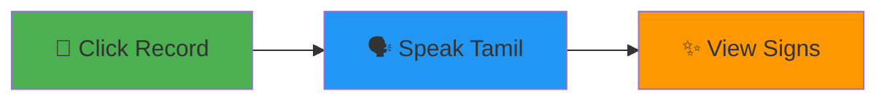
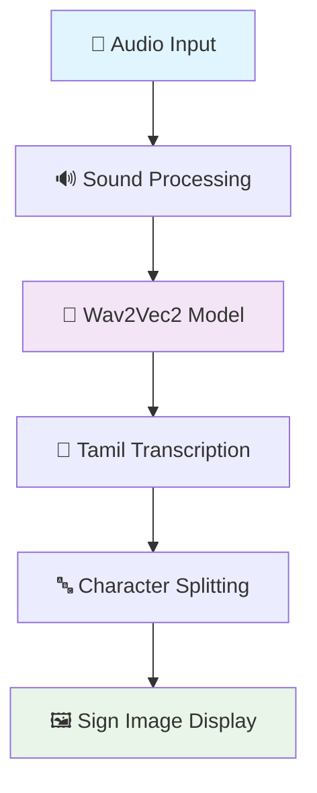
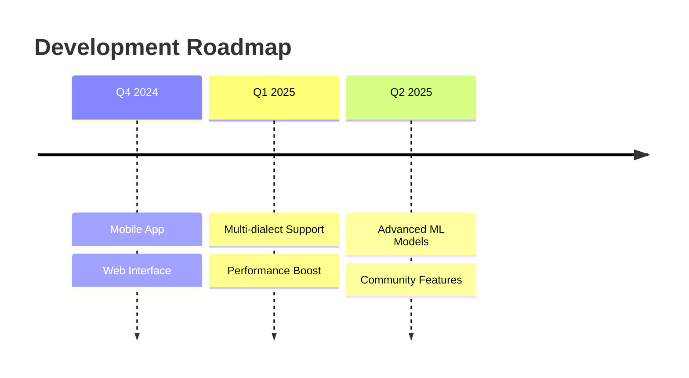

<div align="center">

# 🎤 Tamil Speech to Sign Language Converter ✋

### *Bridging Communication Through AI-Powered Tamil Speech Recognition*

<p align="center">
  
  
  
  
</p>

<p align="center">
  <strong>Transform spoken Tamil words into beautiful sign language representations in real-time</strong>
</p>


</div>

---

## 🌟 **Features**

<table>
<tr>
<td width="50%">

### 🎯 **Core Capabilities**
- 🗣️ **Real-time Speech Recognition**
- 🔤 **Comprehensive Tamil Character Support**
- 🔢 **Smart Number Conversion**
- 🖼️ **Visual Sign Language Display**
- ⚡ **Lightning Fast Processing**

</td>
<td width="50%">

### 🎨 **User Experience**
- 🌙 **Modern Dark Theme Interface**
- 📱 **Responsive Layout**
- 🎧 **Built-in Audio Recording**
- 🧹 **One-click Clear Function**
- 🔄 **Seamless Mode Switching**

</td>
</tr>
</table>

---

## 🚀 **Quick Start**

### **Prerequisites**
```bash
Python 3.7+ | Microphone Access | Internet Connection (first run)
```

### **Installation**
```bash
# 1️⃣ Clone the repository
git clone <repository-url>
cd tamil-speech-to-sign

# 2️⃣ Install dependencies
pip install -r requirements.txt

# 3️⃣ Set up sign images directory
mkdir tamil_alphabets
# Add your Tamil sign language images here

# 4️⃣ Run the application
python tamil_speech_to_sign.py
```

### **Requirements File**
```txt name=requirements.txt
tkinter
pillow>=9.0.0
sounddevice>=0.4.0
scipy>=1.7.0
torch>=1.11.0
transformers>=4.20.0
torchaudio>=0.11.0
numpy>=1.21.0
```

---

## 🎮 **How to Use**

<div align="center">

### **Three Simple Steps**



</div>

| Button | Function | Duration |
|--------|----------|----------|
| **🎤 Words to Sign** | Record Tamil words/sentences | 4 seconds |
| **🔢 Numbers to Sign** | Record Tamil numbers | 4 seconds |
| **🧹 Clear** | Reset display and transcription | Instant |

---

## 📝 **Supported Characters**

<details>
<summary><strong>🔤 Tamil Vowels (உயிர்)</strong></summary>

```
அ  ஆ  இ  ஈ  உ  ஊ  எ  ஏ  ஐ  ஒ  ஓ  ஔ  ஃ
```

</details>

<details>
<summary><strong>🔤 Tamil Consonants (மெய்)</strong></summary>

```
க  ங  ச  ஞ  ட  ண  த  ந  ப  ம  ய  ர  ல  வ  ழ  ள  ற  ன
```

</details>

<details>
<summary><strong>🔢 Numbers & Digits</strong></summary>

**Tamil Digits:** ௦ ௧ ௨ ௩ ௪ ௫ ௬ ௭ ௮ ௯

**English Digits:** 0 1 2 3 4 5 6 7 8 9

**Tamil Words:** ஒன்று, இரண்டு, மூன்று, நான்கு, ஐந்து, ஆறு, ஏழு, எட்டு, ஒன்பது

</details>

---

## ⚙️ **Technical Architecture**

<div align="center">



</div>

### **🧠 AI Model Specifications**

| Component | Specification |
|-----------|--------------|
| **Model** | `Amrrs/wav2vec2-large-xlsr-53-tamil` |
| **Framework** | Hugging Face Transformers |
| **Language** | Tamil (தமிழ்) |
| **Sample Rate** | 16kHz |
| **Processing** | CPU Optimized |

---

## 🏗️ **Project Structure**

```
📦 tamil-speech-to-sign/
├── 📄 tamil_speech_to_sign.py    # 🚀 Main application
├── 📄 requirements.txt           # 📋 Dependencies
├── 📄 README.md                  # 📖 This file
├── 📁 tamil_alphabets/           # 🖼️ Sign language images
│   ├── 🖼️ அ.jpg
│   ├── 🖼️ ஆ.jpg
│   ├── 🖼️ க.jpg
│   └── 🖼️ ... (other characters)
└── 📄 output.wav                 # 🎵 Temporary audio file
```

---

## 🎨 **Customization**

<details>
<summary><strong>🖼️ Adding New Sign Images</strong></summary>

1. **Prepare Image**: Ensure it's in `.jpg` format
2. **Naming**: Use the Tamil character as filename (`அ.jpg`)
3. **Location**: Place in `tamil_alphabets/` directory
4. **Size**: Recommended 200x200px or higher

</details>

<details>
<summary><strong>⏱️ Adjust Recording Duration</strong></summary>

```python
# In record_and_transcribe() function
duration = 5  # Change from 4 to 5 seconds
```

</details>

<details>
<summary><strong>🎨 Theme Customization</strong></summary>

```python
# Background colors
root.configure(bg="#your_color")

# Canvas styling  
canvas = tk.Canvas(root, bg="#your_canvas_color", ...)

# Text colors
transcription_label = tk.Label(..., fg="#your_text_color", ...)
```

</details>

---

## 🐛 **Troubleshooting**

<details>
<summary><strong>❌ Common Issues & Solutions</strong></summary>

| Issue | Solution |
|-------|----------|
| **🎤 No audio detected** | Check microphone permissions & connection |
| **🖼️ Missing sign images** | Verify `tamil_alphabets/` folder exists with proper naming |
| **🐌 Slow performance** | Ensure stable internet for first-time model download |
| **🔒 Token errors** | Verify Hugging Face token validity |
| **💾 Memory issues** | Close other applications, restart if needed |

</details>

---

## 🤝 **Contributing**

We welcome contributions! Here's how you can help:

<div align="center">

[](https://github.com)

</div>

### **Areas for Enhancement**
- 🎯 Additional Tamil dialects support
- 🖼️ Expand sign image database
- ⚡ Performance optimizations
- 🎨 UI/UX improvements
- 📱 Mobile app version
- 🌐 Web-based interface

---

## 📄 **License & Attribution**

<div align="center">

[](LICENSE)

</div>

### **Acknowledgments**
- 🤗 **Hugging Face** - For providing the AI model infrastructure
- 👨‍💻 **Amrrs** - For training the Tamil Wav2Vec2 model
- 🤟 **Tamil Sign Language Community** - For language references
- 💻 **Open Source Contributors** - For making this possible

---

## 🎯 **What's Next?**

<div align="center">

### **Roadmap 2024-2025**



</div>

---

<div align="center">

## 💙 **Made with Love for Tamil Community**

<p>
<strong>Empowering communication • Breaking barriers • Connecting hearts</strong>
</p>

<p>


</p>

---

### 📞 **Support & Contact**

<p>
<a href="mailto:support@example.com"></a>
<a href="#"></a>
<a href="#"></a>
</p>

**Created by:** [Mithunkumar14](https://github.com/Mithunkumar14) • **Last Updated:** August 29, 2025

</div>
