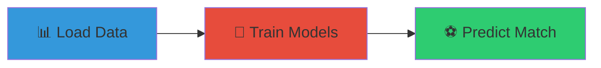
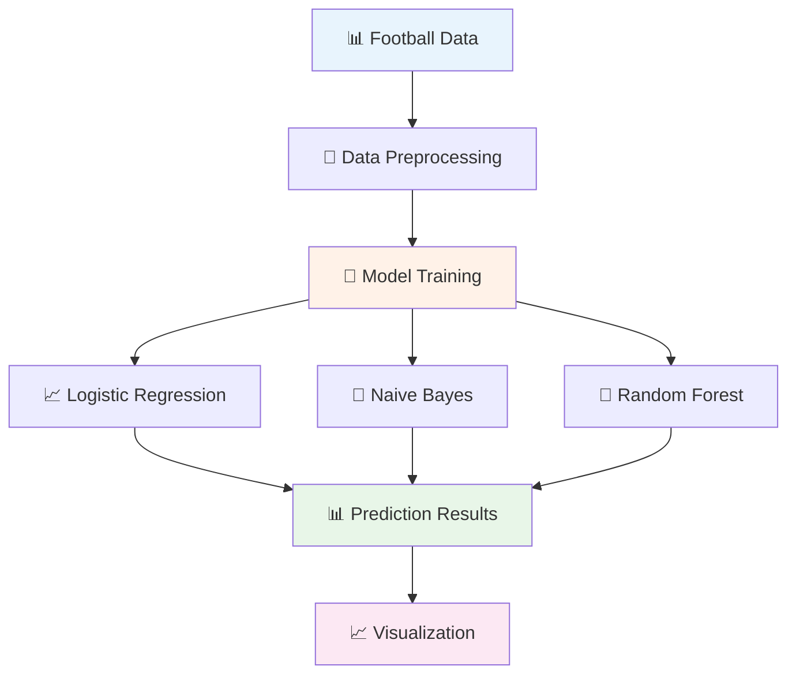
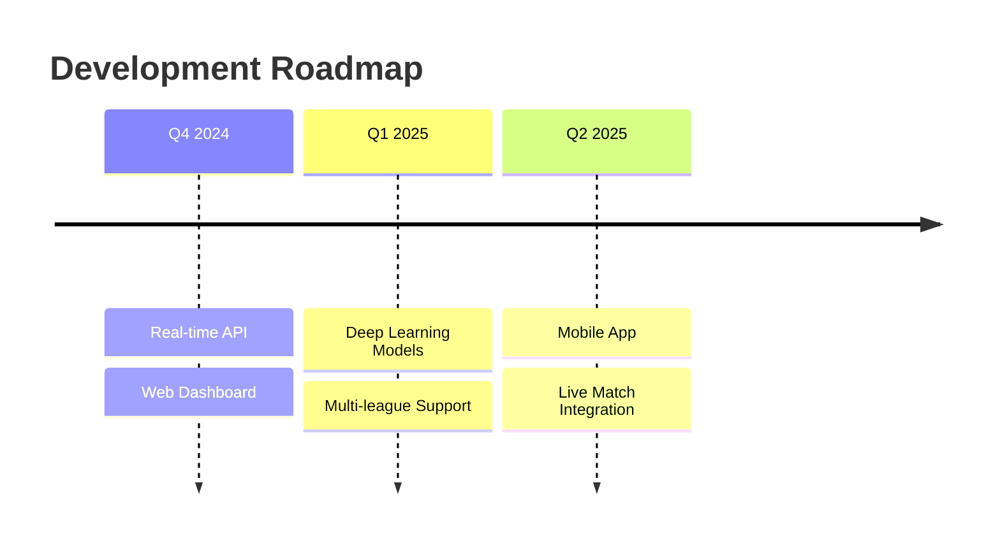

<div align="center">

# ⚽ Football Match Predictor 📊

### *AI-Powered Football Match Outcome Prediction using Machine Learning*

<p align="center">
  
  
  
  
</p>

<p align="center">
  <strong>Predict football match outcomes with multiple ML algorithms and interactive visualizations</strong>
</p>

</div>

---

## 🌟 **Features**

<table>
<tr>
<td width="50%">

### 🎯 **Core Capabilities**
- ⚽ **Match Outcome Prediction** (Win/Draw/Loss)
- 🤖 **Multiple ML Algorithms**
- 📊 **Probability Analysis**
- 💾 **Model Export & Import**
- 📈 **Interactive Visualizations**

</td>
<td width="50%">

### 🔬 **Machine Learning**
- 🌲 **Random Forest Classifier**
- 📈 **Logistic Regression**
- 🎯 **Naive Bayes**
- 📊 **F1-Score & Accuracy Metrics**
- 🔄 **Cross-Validation Ready**

</td>
</tr>
</table>

---

## 🚀 **Quick Start**

### **Prerequisites**
```bash
Python 3.8+ | Football Dataset | Basic ML Knowledge
```

### **Installation**
```bash
# 1️⃣ Clone the repository
git clone <repository-url>
cd football-match-predictor

# 2️⃣ Install dependencies
pip install -r requirements.txt

# 3️⃣ Add your dataset
# Place season-1819.csv in the root directory

# 4️⃣ Run the predictor
python match_predictor.py
```

### **Requirements File**
```txt name=requirements.txt
pandas>=1.3.0
numpy>=1.21.0
scikit-learn>=1.0.0
matplotlib>=3.4.0
joblib>=1.1.0
```

---

## 🎮 **How to Use**

<div align="center">

### **Three Simple Steps**



</div>

### **Input Parameters**

| Parameter | Description | Example |
|-----------|-------------|---------|
| **🏠 Home Team Encoded** | Numerical ID for home team | `15` |
| **✈️ Away Team Encoded** | Numerical ID for away team | `8` |
| **⚽ HTHG** | Home Team Half-Time Goals | `2` |
| **⚽ HTAG** | Away Team Half-Time Goals | `0` |
| **🎯 HS** | Home Team Total Shots | `18` |
| **🎯 AS** | Away Team Total Shots | `12` |
| **🎯 HST** | Home Team Shots on Target | `6` |
| **🎯 AST** | Away Team Shots on Target | `4` |
| **🔴 HR** | Home Team Red Cards | `0` |
| **🔴 AR** | Away Team Red Cards | `1` |

---

## 📊 **Machine Learning Models**

<div align="center">



</div>

### **🎯 Model Performance Metrics**

| Model | Type | Strengths |
|-------|------|-----------|
| **📈 Logistic Regression** | Linear Classifier | Fast, interpretable, probabilistic |
| **🎯 Naive Bayes** | Probabilistic | Works well with small datasets |
| **🌲 Random Forest** | Ensemble Method | High accuracy, handles overfitting |

---

## 🏗️ **Project Structure**

```
📦 football-match-predictor/
├── 📄 match_predictor.py         # 🚀 Main prediction script
├── 📄 requirements.txt           # 📋 Dependencies
├── 📄 README.md                  # 📖 This file
├── 📊 season-1819.csv           # 📈 Training dataset
├── 📁 exportedModels/           # 💾 Saved ML models
│   └── 📄 lr                    # 📈 Logistic regression model
└── 📊 prediction_charts/        # 📊 Generated visualizations
```

---

## 📈 **Dataset Schema**

<details>
<summary><strong>📊 Required Columns</strong></summary>

```python
# Input Features
home_encoded     # Encoded home team ID
away_encoded     # Encoded away team ID
HTHG            # Home team half-time goals
HTAG            # Away team half-time goals
HS              # Home team shots
AS              # Away team shots
HST             # Home team shots on target
AST             # Away team shots on target
HR              # Home team red cards
AR              # Away team red cards

# Target Variable
FTR             # Full-time result (H/D/A)
```

</details>

<details>
<summary><strong>🎯 Prediction Classes</strong></summary>

| Code | Meaning | Description |
|------|---------|-------------|
| **H** | Home Win | Home team victory |
| **D** | Draw | Match ends in tie |
| **A** | Away Win | Away team victory |

</details>

---

## 🎨 **Sample Usage**

<details>
<summary><strong>⚽ Example Prediction Session</strong></summary>

```python
# Input Example
Home Team Encoded: 15
Away Team Encoded: 8
Home Team Half-Time Goals: 2
Away Team Half-Time Goals: 0
Home Team Shots: 18
Away Team Shots: 12
Home Team Shots on Target: 6
Away Team Shots on Target: 4
Home Team Red Cards: 0
Away Team Red Cards: 1

# Output
Predictions: ['Home Win']
Predicted Probabilities: [[0.15, 0.25, 0.60]]
# Away Win: 15%, Draw: 25%, Home Win: 60%
```

</details>

<details>
<summary><strong>📊 Visualization Output</strong></summary>

The system generates:
- 📊 **Probability bar charts**
- 📈 **Confidence intervals**
- 🎯 **Prediction accuracy metrics**
- 📉 **Model comparison plots**

</details>

---

## 🛠️ **Advanced Features**

<details>
<summary><strong>💾 Model Export & Import</strong></summary>

```python
# Export trained model
shouldExport = input('Do you want to export the model(s) (y / n) ? ')
if shouldExport.strip().lower() == 'y':
    dump(lr_classifier, 'exportedModels/lr')

# Load saved model
loaded_model = load('exportedModels/lr')
predictions = loaded_model.predict(new_data)
```

</details>

<details>
<summary><strong>📊 Custom Visualizations</strong></summary>

```python
# Generate probability charts
labels = ['Away Win', 'Draw', 'Home Win']
plt.bar(x, probabilities, width=0.35)
plt.title('Predicted Probabilities for Each Match')
plt.xlabel('Outcome')
plt.ylabel('Predicted Probability')
```

</details>

---

## 🎯 **Performance Optimization**

### **🚀 Speed Improvements**
- ⚡ Efficient data preprocessing
- 🔄 Optimized model training
- 💾 Model caching system
- 📊 Vectorized predictions

### **🎯 Accuracy Enhancement**
- 📈 Feature engineering
- 🔄 Cross-validation
- 📊 Ensemble methods
- 🎯 Hyperparameter tuning

---

## 🐛 **Troubleshooting**

<details>
<summary><strong>❌ Common Issues & Solutions</strong></summary>

| Issue | Cause | Solution |
|-------|-------|----------|
| **📊 Dataset not found** | Missing CSV file | Ensure `season-1819.csv` exists |
| **🔢 Encoding errors** | Invalid team names | Check team encoding consistency |
| **💾 Model export fails** | Permission issues | Check directory write permissions |
| **📈 Poor accuracy** | Insufficient data | Add more training samples |
| **🎯 Prediction errors** | Invalid input format | Validate input data types |

</details>

---

## 🤝 **Contributing**

We welcome contributions! Here's how you can help:

<div align="center">

[](https://github.com)

</div>

### **🎯 Areas for Enhancement**
- 📊 Advanced feature engineering
- 🤖 Deep learning models
- 📱 Web dashboard interface
- 🔄 Real-time data integration
- 📈 Advanced visualization
- 🎯 Multi-league support

### **🔄 Development Workflow**
1. Fork the repository
2. Create feature branch
3. Add tests for new features
4. Submit pull request
5. Code review process

---

## 📄 **License & Attribution**

<div align="center">

[](LICENSE)

</div>

### **📊 Data Sources**
- Football match statistics
- Historical season data
- Team performance metrics

### **🤖 ML Libraries**
- **Scikit-learn** - Machine learning algorithms
- **Pandas** - Data manipulation
- **NumPy** - Numerical computations
- **Matplotlib** - Data visualization

---

## 🎯 **What's Next?**

<div align="center">

### **Roadmap 2024-2025**



</div>

### **🚀 Upcoming Features**
- 🌐 **Web Interface** - Browser-based predictions
- 📱 **Mobile App** - iOS/Android support
- 🔄 **Live Data** - Real-time match integration
- 🤖 **Advanced AI** - Neural networks & deep learning
- 📊 **Enhanced Analytics** - Advanced statistics
- 🎯 **Multi-Sport** - Expand beyond football

---

<div align="center">

## ⚽ **Made for Football Enthusiasts**

<p>
<strong>Predicting the beautiful game • Data-driven insights • Advanced analytics</strong>
</p>

<p>


</p>

---

### 📞 **Support & Contact**

<p>
<a href="mailto:support@example.com"></a>
<a href="#"></a>
<a href="#"></a>
</p>

**Created by:** [Mithunkumar14](https://github.com/Mithunkumar14) • **Last Updated:** August 29, 2025

</div>
